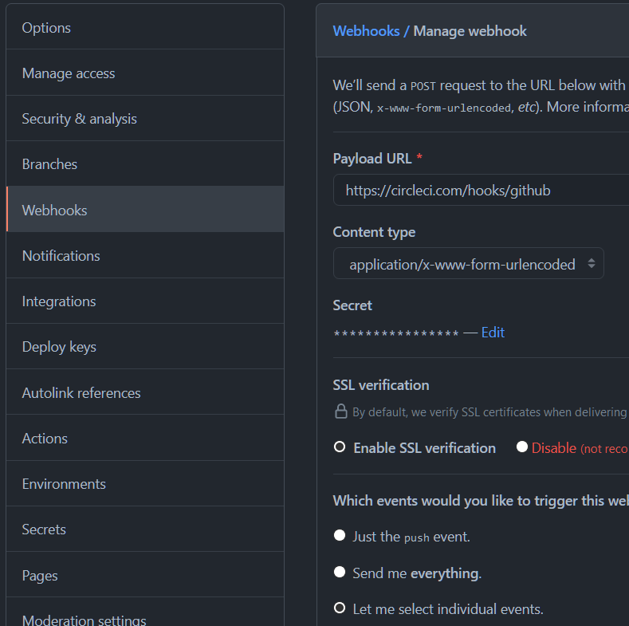
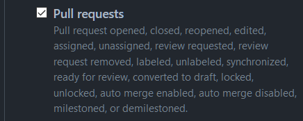

# Rapport på Ci/Cd inlämningsuppgift 1

Jag börjar med att skapa upp ett nytt publikt repo på GitHub som jag döper till
**CiCd_Inlamning1** (<https://github.com/kthure01/CiCd_Inlamning1>). Under
settings/notifications,
<https://github.com/kthure01/CiCd_Inlamning1/settings/notifications>, så lägger
jag in min epost-adress så att jag blir notifierad varje gång det görs en ”push”
till detta repo.

Repot klonar jag sedan ner på min Linux-maskin med:

`git clone
`[`git@github.com:kthure01/CiCd_Inlamning1.git`](mailto:git@github.com:kthure01/CiCd_Inlamning1.git)*.*

Jag skapar även en ny branch som jag kallar dev. I denna branch kommer all
utveckling av appen att ske.

~~~~~~~~~~~~~~~~~~~~~~~~~~~~~~~~~~~~~~~~~~~~~~~~~~~~~~~~~~~~~~~~~~~~~~~~~~~~~~~~
git checkout dev
~~~~~~~~~~~~~~~~~~~~~~~~~~~~~~~~~~~~~~~~~~~~~~~~~~~~~~~~~~~~~~~~~~~~~~~~~~~~~~~~

Nu börjar jag med att skapa lite filer. En .gitignore som innehåller information
vad som inte ska ”pushas” upp mot GitHub och en requirements.txt som kommer
innehålla information om de extra moduler som appen kommer att behöva för att
kunna köras och testas på ett korrekt sätt.

Nu gör en första synkning mot GitHub med:

~~~~~~~~~~~~~~~~~~~~~~~~~~~~~~~~~~~~~~~~~~~~~~~~~~~~~~~~~~~~~~~~~~~~~~~~~~~~~~~~
git add –all
git commit -m “First commit”
git push --set-upstream origin dev
~~~~~~~~~~~~~~~~~~~~~~~~~~~~~~~~~~~~~~~~~~~~~~~~~~~~~~~~~~~~~~~~~~~~~~~~~~~~~~~~

Efter detta så gör jag en enkel kalkylator-app i Python med tillhörande tester.
Appen finns i calculator.py och testarna ligger i test_calculator.py. Även dessa
filer ”pushas” till GitHub.

För att kolla om appen följer en vedertagen kodstandard så installerar jag en
modul till Python som heter flake8. Jag installerar även modulen pytest som kör
de tester jag skapat för appen.

