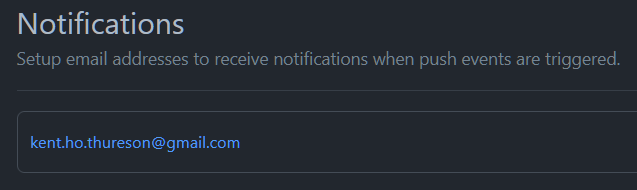
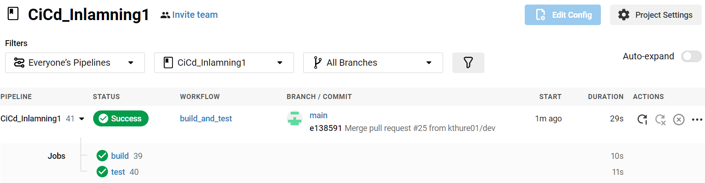

# Rapport på inlämningsuppgift 1 i Ci/Cd

Jag börjar med att skapa upp ett nytt publikt repo på GitHub som jag döper till
[**CiCd_Inlamning1**](https://github.com/kthure01/CiCd_Inlamning1). Under
[settings/notifications,](https://github.com/kthure01/CiCd_Inlamning1/settings/notifications),
så lägger jag in min epost-adress så att jag blir notifierad varje gång det görs en ”push”
till detta repo.

Repot klonar jag sedan ner på min Linux-maskin med:

>git clone [https://github.com/kthure01/CiCd_Inlamning1.git](https://github.com/kthure01/CiCd_Inlamning1.git)

Jag skapar även en ny branch som jag kallar dev. I denna branch kommer all
utveckling av appen att ske.

>git checkout dev

Nu börjar jag med att skapa lite filer. En **_.gitignore_** som innehåller information
vad som **inte** ska ”pushas” upp mot GitHub och en **_requirements.txt_** som kommer
innehålla information om de extra moduler som appen kommer att behöva för att
kunna köras och testas på ett korrekt sätt.

Nu gör en första synkning mot GitHub med:
>git add --all\
>git commit -m “First commit”\
>git push --set-upstream origin dev

Efter detta så gör jag en enkel kalkylator-app i Python med tillhörande tester.
Appen finns i **_calculator.py_** och testarna ligger i **_test_calculator.py_**. Även dessa
filer ”pushas” till GitHub.

För att kolla om appen följer en vedertagen kodstandard så installerar jag en
modul till Python som heter **_flake8_**. Jag installerar även modulen **_pytest_** som kör
de tester jag skapat för appen.
Kommandot för att testa kodstandarden är: `flake8 <app_file_name>`
Kommandot för att köra testerna är: `pytest -v <test_file_name>`

För att bygga applikationen och köra tester på den så använder jag mig av verktyget
[CircleCi](https://circleci.com/). Jag har kopplat ihop mina konton på GitHub och CircleCi.
Detta gör att jag då enkelt kan välja mitt GitHub-repo och sedan skapa en konfigurationsfil **_config.yml_**
som jag sedan lägger in på mitt repo. I denna fil så skapar jag olika jobb som jag sedan kör
i sektionen "workflows". Jag har valt att skapa ett jobb som jag kallar **_build_** och ett som
jag kallar **_test_**.
För att detta ska triggas igång så måste man ha gjort en manuell pull request från branchen dev till main.
Vidare så för att testerna ska köras så måste build-jobbet ha gått igenom felfritt annars så kommer
inte testerna att köras.
Testerna som körs är en kontroll av kodstandarden och en test där 2 funktioner i appen kontrolleras.

Så här ser det ut i CircleCi när workflowet är kört med lyckat resultat.

Anledningen att jag kört så många jobb är att jag experimenterat med att bara trigga ett jobb i
CircleCi när man gjort en pull request till main. Som det är nu så skapas ett jobb vid varje push till
dev-branchen. Detta jobb "filtreras" bort i config.yml men jag ville inte det skulle dyka upp i CCI
över huvud taget. Sedan blir det lite syntax-fel i YAML till och från annars så har väl det mesta
flutit på bra tycker jag.

Det som saknas för att uppnå CD skulle väl vara att ha automatiskt skapa pull requests och att få 
ett automatiskt godkännande av dessa så att koden automatiskt mergas in till main branchen. 
